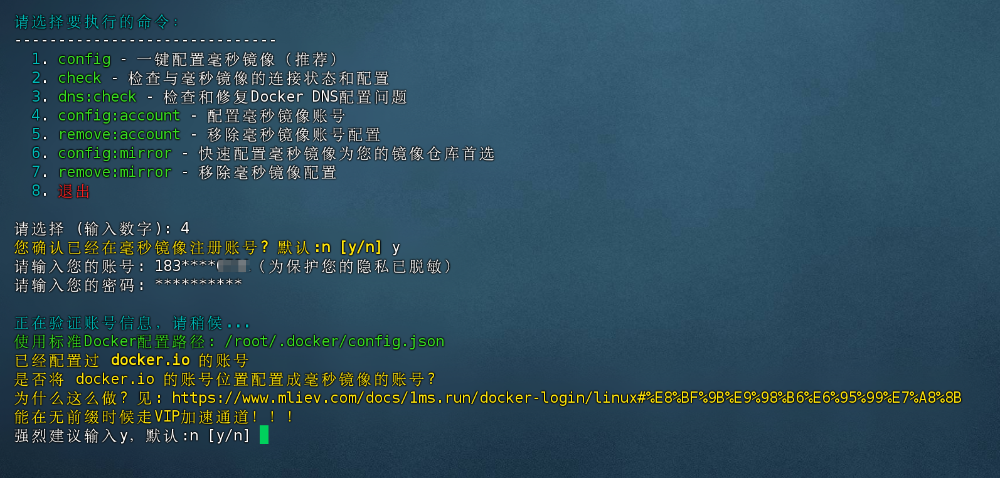

# Axon

Axon is a lightweight Go library for building interactive command-line applications, providing simple and easy-to-use terminal interaction features.

## Features

- Simple and easy-to-use API, focused on providing quality terminal interaction experiences
- Supports multiple interaction methods: standard questions, confirmation prompts, password input, phone number input, and list selection
- Built-in data validation and formatting functions
- Support for default values
- Automatic masking of phone numbers to protect user privacy
- Colored output support for enhanced visual experience

> Already used in the Millisecond Mirror CLI configuration tool (shown below)



## Installation

```bash
go get github.com/muleiwu/axon
```

## Quick Start

```go
package main

import (
	"fmt"
	"github.com/muleiwu/axon"
	"github.com/muleiwu/axon/pkg/question"
)

func main() {
	// Standard question
	name := axon.Question("Please enter your name: ", "")
	fmt.Printf("Hello, %s!\n", name)
	
	// Confirmation question
	proceed := axon.Confirm("Continue? (y/n) ", true)
	if proceed {
		fmt.Println("Continuing...")
	} else {
		fmt.Println("Cancelled")
		return
	}
	
	// Password input (hidden display)
	password := axon.Password("Please enter password: ", "")
	fmt.Println("Password saved")
	
	// Phone number (with validation and masking)
	phone := axon.PhoneNumber("Please enter mobile number: ", "")
	fmt.Println("Mobile number saved")
	
	// Selection list
	items := []question.SelectionItem{
		{Label: "Option 1", Description: "This is the first option", Value: "option1"},
		{Label: "Option 2", Description: "This is the second option", Value: "option2"},
		{Label: "Option 3", Description: "This is the third option", Value: "option3"},
	}
	selected := axon.Selection("Please select an option:", items)
	
	if selected == "exit" {
		fmt.Println("You chose to exit")
	} else {
		fmt.Printf("You selected: %s\n", selected)
	}
}
```

## API Reference

### Standard Question

```go
func Question(question string, defaultValue string) string
```

Ask the user a standard question and get text input.

- `question`: The question text to display to the user
- `defaultValue`: Default value, used when the user presses enter directly
- Returns: The string entered by the user

### Confirmation Question

```go
func Confirm(question string, defaultValue bool) bool
```

Ask the user a confirmation question to get a yes/no answer.

- `question`: The question text to display to the user
- `defaultValue`: Default value, used when the user presses enter directly
- Returns: The user's selection result (true/false)

### Password Input

```go
func Password(question string, defaultValue string) string
```

Ask the user for a password, which will be hidden during input.

- `question`: The question text to display to the user
- `defaultValue`: Default value, used when the user presses enter directly
- Returns: The password string entered by the user

### Phone Number Input

```go
func PhoneNumber(question string, defaultValue string) string
```

Ask the user for a phone number, with format validation. The input is automatically masked to protect user privacy.

- `question`: The question text to display to the user
- `defaultValue`: Default value, used when the user presses enter directly
- Returns: The validated phone number string

### Selection List

```go
func Selection(question string, items []SelectionItem) string
```

Let the user select an item from a list.

- `question`: The question text to display to the user
- `items`: The list of selection items
- Returns: The Value of the selected item, or "exit" if the user chooses to exit

## Custom Selection Items

When creating a selection list, you can define options using the `SelectionItem` structure:

```go
type SelectionItem struct {
	Label       string // The display label
	Description string // Description information
	Value       string // Actual value
}
```

## License

This project is open source under the [LICENSE](LICENSE) license.